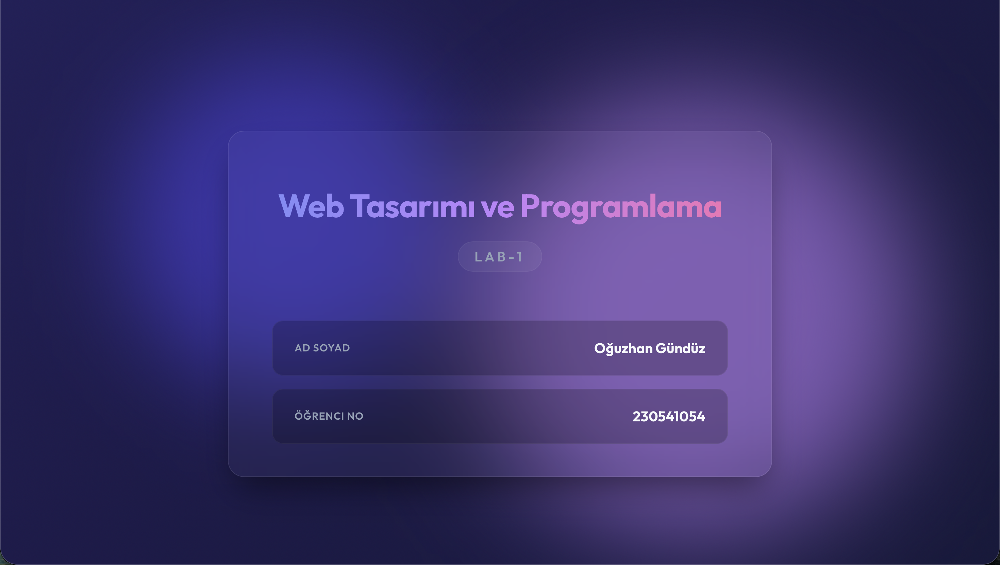
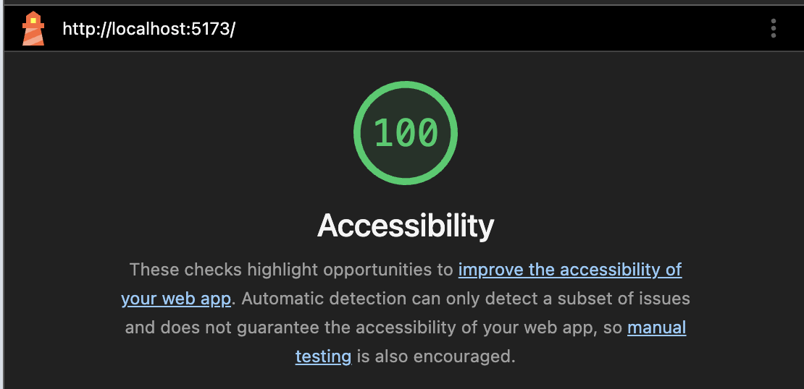

# Web Tasarımı ve Programlama Laboratuvar Çalışmaları

Bu depo, Web Tasarımı ve Programlama dersi kapsamındaki laboratuvar çalışmalarını içermektedir.

## Geliştirici
**Ad Soyad:** Oğuzhan Gündüz  
**Öğrenci No:** 230541054

---

## Lab 1: Temel Kurulum ve Modern UI Tasarımı

Bu projede Vite + React + TypeScript kullanılarak temel bir web uygulaması oluşturulmuş ve modern bir arayüz ile (Glassmorphism vb.) şekillendirilmiştir.

### Kullanılan Teknolojiler
* React 18
* TypeScript
* Vite
* Özel CSS (Animasyonlar, Modern UI)

### Kurulum
```bash
npm install
```

### Çalıştırma
```bash
npm run dev
```
Tarayıcıda `http://localhost:5173` adresini açın.

### Ekran Görüntüleri


### Yapılan Commitler

* [`7a317dc`](https://github.com/Ulwus/weblab/commit/7a317dc) Merge pull request #2 from Ulwus/feature/personalize-ui
* [`a722d4c`](https://github.com/Ulwus/weblab/commit/a722d4c) style : update page styling and layout
* [`ec3accd`](https://github.com/Ulwus/weblab/commit/ec3accd) Merge pull request #1 from Ulwus/feature/personalize-ui
* [`62fe894`](https://github.com/Ulwus/weblab/commit/62fe894) docs: add comprehensive README
* [`4688c40`](https://github.com/Ulwus/weblab/commit/4688c40) feat: add personal details to homepage
* [`2dbf330`](https://github.com/Ulwus/weblab/commit/2dbf330) chore: initial project setup with Vite React + TS

---

## Lab 2: Semantik HTML ve Erişilebilirlik (A11Y)

Bu çalışmada, önceden oluşturulan portföy tasarımı semantik HTML5 etiketleriyle (header, nav, main, section, article, footer vb.) yeniden yapılandırılmış ve Web Erişilebilirlik Yönergelerine (WCAG 2.1) tam uyumlu hale getirilmiştir. Neumorphic modern bir UI tasarımı uygulanmıştır.

### Değerlendirme Kriterleri (Checklist)

- [x] Sayfa semantik etiketlerle yapılandırılmış mı? (`header`, `nav`, `main`, `section`, `article`, `footer`)
- [x] Heading hiyerarşisi doğru mu? (`h1` → `h2` → `h3`, seviye atlanmamış)
- [x] Tüm görsellerde anlamlı `alt` metni var mı?
- [x] İletişim formu mevcut ve tüm input'larda `<label>` ilişkisi kurulmuş mu?
- [x] Form alanlarında `required`, `minlength`, `type` gibi doğrulama öznitelikleri var mı?
- [x] Hata mesajı alanları (`<small>` + `role="alert"`) hazırlanmış mı?
- [x] Tab ile gezinme sorunsuz çalışıyor mu? Focus göstergesi görünüyor mu?
- [x] Skip navigation bağlantısı eklenmiş mi?
- [x] `<html lang="tr">` ayarlanmış mı?
- [x] Lighthouse erişilebilirlik puanı 90+ mı? (Ekran görüntüsü eklendi)
- [x] En az 3 commit atılmış ve branch kullanılmış mı?
- [x] GitHub'a push edilmiş mi?

### Erişilebilirlik Puanı (Lighthouse)


### Yapılan Commitler

* [`462c145`](https://github.com/Ulwus/weblab/commit/462c145) feat(a11y): add accessible react form validation with role alert
* [`a7f1ab4`](https://github.com/Ulwus/weblab/commit/a7f1ab4) Merge pull request #3 from Ulwus/feature/semantic-portfolio
* [`46c2bf7`](https://github.com/Ulwus/weblab/commit/46c2bf7) fix(a11y): remove noValidate from form to enforce HTML5 required fields
* [`d64d8d7`](https://github.com/Ulwus/weblab/commit/d64d8d7) fix: adjust text colors for improved a11y contrast ratio
* [`54897a8`](https://github.com/Ulwus/weblab/commit/54897a8) fix: ensure strict a11y focus indicators are visible in neumorphic ui
* [`275f589`](https://github.com/Ulwus/weblab/commit/275f589) style: perfect neumorphic redesign to match provided image and update social links
* [`a44366b`](https://github.com/Ulwus/weblab/commit/a44366b) style: add base CSS and skip link
* [`534fba9`](https://github.com/Ulwus/weblab/commit/534fba9) feat: add accessible contact form
* [`67c65ec`](https://github.com/Ulwus/weblab/commit/67c65ec) feat: add semantic HTML portfolio structure
